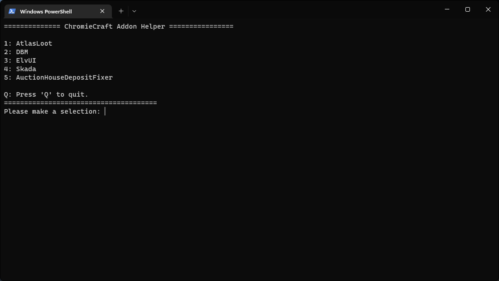

# 
### This script was written to help me maintain and install some commonly used AddOns. Please, feel free to fork and improve the script. Make pull request so I can merge them back to the original project. Set $global:addons variable at the top of the Powershell script to your addons folder.

